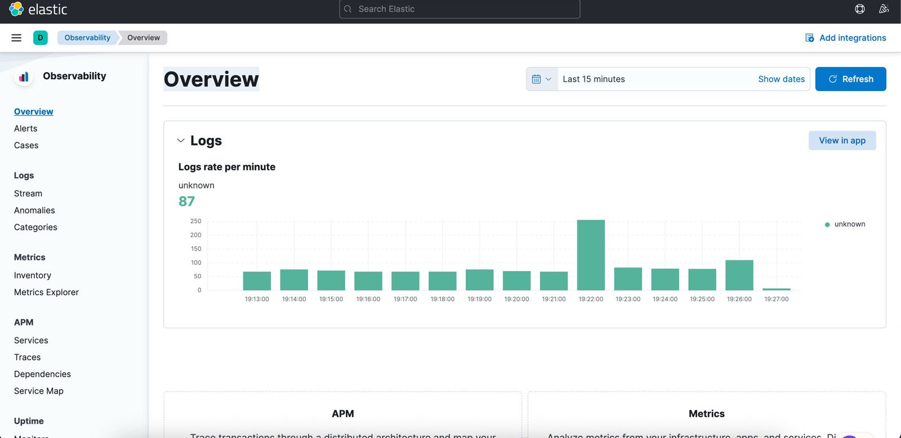

# Elastic Stack (ELK) on Kubernetes

This project demonstrates how to deploy the Elastic Stack (Elasticsearch, Kibana, and Filebeat) on a Kubernetes cluster to collect and analyze application logs.


## 📋 Architecture

The project includes the following components:

- **Elasticsearch**: The central search and storage engine for data and logs
- **Kibana**: Visual interface for data exploration and analysis
- **Filebeat**: Log collection agent deployed on every node in the cluster
- **Hello World App**: A sample application that generates logs to test the stack

## 🔍 Screenshots

<details>
<summary>Deployment</summary>
<p align="center">
  
  
</p>
</details>

<details>
<summary>Elasticsearch</summary>
<p align="center">
  
  
  
</p>
</details>

<details>
<summary>Kibana and Logs</summary>
<p align="center">
  
  
</p>
</details>

## ⚙️ Prerequisites

- Access to a Kubernetes cluster
- `kubectl` installed and configured to work with your cluster
- Sufficient cluster resources (recommended at least 4GB RAM and 2 CPU cores)

## 📁 Project Structure

```
📂 elastic-stack-k8s
 ├── 📂 k8s-manifests       # YAML files for resource definitions
 │   ├── namespace.yaml     # Create dedicated namespace
 │   ├── elasticsearch.yaml # Elasticsearch configuration (StatefulSet + Service)
 │   ├── kibana.yaml        # Kibana configuration (Deployment + Service)
 │   ├── filebeat.yaml      # Filebeat configuration (DaemonSet)
 │   ├── app.yaml           # Hello World sample application
 ├── 📂 scripts             # Automation scripts
 │   ├── deploy.sh          # Script to deploy all components
 │   ├── delete.sh          # Script to remove all components
 ├── 📂 screenshots         # Deployment evidence screenshots
 ├── README.md              # Documentation
 ├── .gitignore             # Files to exclude from GitHub
```

## 🚀 Installation Instructions

### 1. Automated Installation

Use the automated installation script:

```bash
# Grant execution permissions to the script
chmod +x scripts/deploy.sh

# Run the installation script
./scripts/deploy.sh
```

### 2. Manual Installation

If you prefer to install manually, execute the following commands:

```bash
# Create the namespace
kubectl apply -f k8s-manifests/namespace.yaml

# Install Elasticsearch
kubectl apply -f k8s-manifests/elasticsearch.yaml

# Install Kibana
kubectl apply -f k8s-manifests/kibana.yaml

# Install Filebeat
kubectl apply -f k8s-manifests/filebeat.yaml

# Install the Hello World application
kubectl apply -f k8s-manifests/app.yaml
```

## 🌐 Accessing Kibana

After installation, you can access the Kibana interface using the configured NodePort:

```bash
# Get the Kibana port
kubectl get service kibana -n elastic-stack -o jsonpath='{.spec.ports[0].nodePort}'
```

The address will be:
- If using minikube: `minikube service kibana -n elastic-stack`
- If using a regular cluster: `http://<NODE_IP>:<KIBANA_PORT>`

Alternatively, you can use port-forwarding for quick access:

```bash
# Port-forward Kibana to localhost
kubectl port-forward -n elastic-stack $(kubectl get pods -n elastic-stack -l app=kibana -o jsonpath='{.items[0].metadata.name}') 5601:5601
```

Then access Kibana at: http://localhost:5601

### Setting up an Index in Kibana

1. Open the Kibana interface in your browser
2. Click on "Explore on my own"
3. In the menu, navigate to "Stack Management" -> "Index Patterns"
4. Click on "Create index pattern"
5. Enter `filebeat-*` in the Pattern name field and click "Next step"
6. Select `@timestamp` as the time field and click "Create index pattern"
7. Now navigate to "Discover" to see the collected logs

## 📊 Viewing Logs

After setting up the stack and configuring the indexes, you can view the logs from the Hello World application:

1. Access the Kibana interface
2. Go to "Discover"
3. Enter the following query in the search field:
   ```
   kubernetes.container.name : "hello-world"
   ```
4. You can now see the logs from the Hello World application

## 🧹 Uninstalling

To remove all installed resources:

```bash
# Grant execution permissions to the script
chmod +x scripts/delete.sh

# Run the uninstallation script
./scripts/delete.sh
```

## ❓ Troubleshooting

<details>
<summary>Elasticsearch Not Starting</summary>

Check the available resources in your cluster. Elasticsearch requires at least 1GB of RAM. Ensure your nodes have sufficient available resources.

```bash
kubectl describe pod -n elastic-stack -l app=elasticsearch
```
</details>

<details>
<summary>Kibana Not Connecting to Elasticsearch</summary>

Make sure Elasticsearch is running and responsive:

```bash
# Check Elasticsearch status
kubectl exec -it -n elastic-stack $(kubectl get pods -n elastic-stack -l app=elasticsearch -o jsonpath='{.items[0].metadata.name}') -- curl -X GET "localhost:9200/_cluster/health"
```
</details>

<details>
<summary>Filebeat Not Sending Logs</summary>

Check the status and logs of Filebeat:

```bash
kubectl logs -n elastic-stack -l app=filebeat
```
</details>

## 👤 Submitter Information

**Candidate Name**: Maor Kadosh  
**Mobile Number**: 050-6113377
